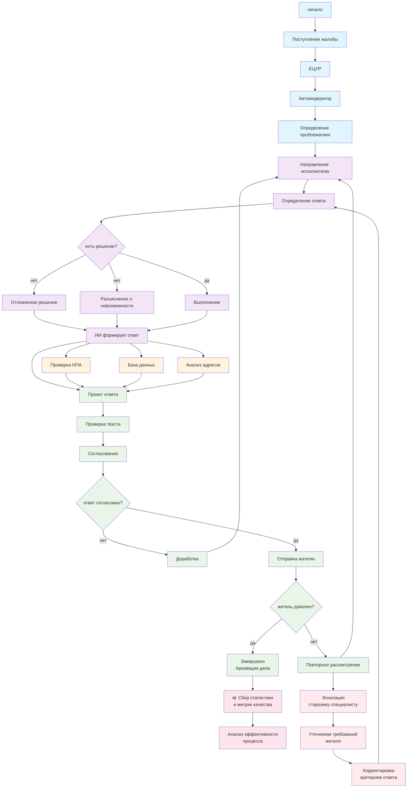
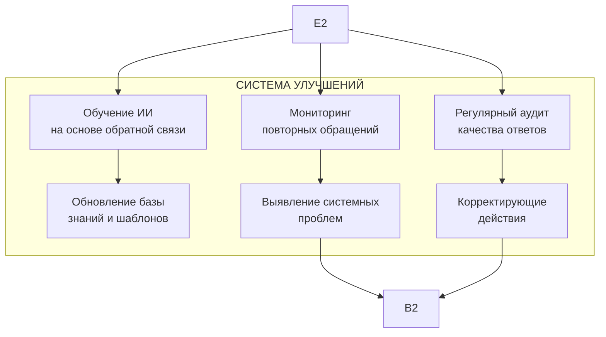

# Диаграмма процесса обработки жалоб



## **Что было добавлено:**

### 1. **Контроль качества и аналитика**
- **Сбор статистики и метрик** - после завершения дела
- **Анализ эффективности** процесса для постоянного улучшения

### 2. **Процесс эскалации** при недовольстве жителя
- **Эскалация старшему специалисту** - при повторных жалобах
- **Уточнение требований** - прямой контакт с жителем
- **Корректировка критериев** - улучшение стандартов ответов

### 3. **Управление сроками (SLA)**
- ⏱ **Фиксация времени** на ключевых этапах
- **Контроль сроков исполнения** - соблюдение регламентов

### 4. **Архивация и документирование**
- **Архивация дела** - после успешного завершения
- **База знаний** - накопление успешных кейсов

## **Дополнительные улучшения которые можно добавить:**

````markdown


    A2 --> O1
    A2 --> O3
    C7 --> O5
```
