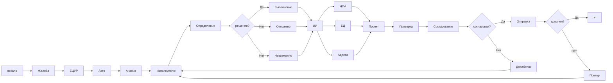

```mermaid
flowchart LR
    %% Первый этап - верх
    A1[начало] --> A2[Жалоба] --> A3[ЕЦУР] --> A4[Авто] --> A5[Анализ]

    %% Второй этап - середина
    B1[Исполнителю] --> B2[Определение] --> B3{решение?}
    B3 -->|Да| B4[Выполнение] --> B5[ИИ]
    B3 -->|Нет| B6[Отложено] --> B5
    B3 -->|Нет| B7[Невозможно] --> B5

    %% Третий этап - низ
    C1[Проект] --> C2[Проверка] --> C3[Согласование] --> C4{согласован?}
    C4 -->|Да| C5[Отправка] --> C6{доволен?}
    C4 -->|Нет| C7[Доработка]
    C6 -->|Да| C8[✔]
    C6 -->|Нет| C9[Повтор]

    %% Данные - справа
    B5 --> D1[НПА] --> C1
    B5 --> D2[БД] --> C1
    B5 --> D3[Адреса] --> C1

    %% Основные связи
    A5 --> B1
    C7 --> B1
    C9 --> B1
```
    D3 --> C1

    C5 --> B1
    C9 --> B1
```
